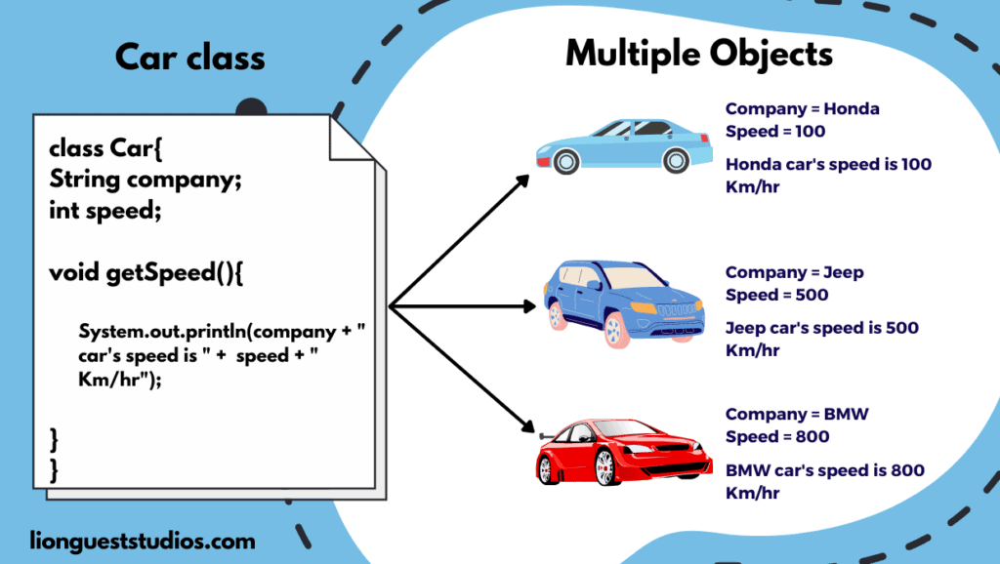

# IEEE OOPs SMP


## About
This Summer Mentorship Program conducted under `IEEE NITK` by the mentors - `Ashish Bharat`, `Mehul Todi` and `Rohan Kamat` aims to introduce freshers to the powerful and very important concepts of `Object Oriented Programming`. Through the summer, we hope to mentor students develop a `Chess` game using concepts of `OOPs` in `C++`.

## Links
- [Google Site](https://sites.google.com/d/1e3Id3ZJkwWskJAfjbZa-7KUGYwRv2ini/p/17aLsGM4hhMg4QnPcaJWSmHP5h02iMwKc/edit)
- The classic game of [Pacman](https://github.com/kid-116/Pac-Man.git) implemented using OOPs in C++.
- [OOPs - GFG](https://www.geeksforgeeks.org/object-oriented-programming-in-cpp/)
- [Coursera OOPs](https://www.coursera.org/learn/cs-fundamentals-1)

## Contributing Guidelines
### Setting Up
- Fork the repo.
- Clone the forked repo using `git clone <repo-url>` to desired directory.
### Pull Requests
- For each new `submission`, `fix` or `feature` create a new branch named `<github-handle>-<explanatory-name>`.
    ```cmd
    git branch <branch-name>
    ```
- Switch to the new branch.
    ```cmd
    git checkout <branch-name>
    ```
- Make the changes in the new branch.
- Stage the changes for the next commit.<br>
    To stage changes from specific files:
    ```cmd
    git add <filename>
    ```
    To stage all the changes at once:
    ```cmd
    git add .
    ```
    Use `git status` to track the changes made.
- Commit the changes.
    ```cmd
    git commit -m "<commit-message>"
    ```
- Push the changes to your forked repo. <br>
    If you're working on a new branch:
    ```cmd
    git push -u origin <branch-name>
    ```
    If the branch already exists:
    ```
    git push
    ```
- Create a `pull request`.
### Submissions
- Submit each assignment to the intended folders under a folder named after your github username e.g. a user named `kid-116` would submit `week-1`'s assignment to the subdirectory - `week_1\submissions\kid-116\`.
- The intended solutions for all the assignments will also be uploaded regularly.
- The submissions guidelines must be strictly followed so as to eliminate painful merge conflicts and easy assessment.

### Keep in Mind
- Use `meaningful small commits`. Refer to this [link](https://cbea.ms/git-commit/).
- `Remember to fetch` changes from the upstream repo before working on something.
